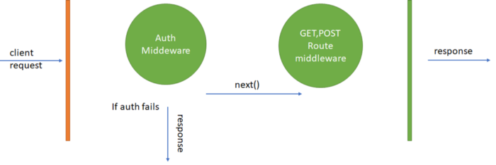

# abuein-online

This is a README.md FILE

## Frontend

### React-Bootstrap Setup, Header & Footer Components

1. Go into src folder and create a folder called components to create header and footer components
2. Header.js. The convention for React.js components is an uppercase first letter
3. rafce snippet to create arrow functional components
4. Import the header and footer components into App.js
5. When a component is exported as "export default", you don't need to wrap it in curly braces when you import the component in App.js
6. <main> tag specifies the main content of a document
7. React bootstrap: CSS framework. Easier to work with compared to material UI. To create a navbar in material UI, you will have to bring in many components
8. To install React bootstrap, use bootswatch.com => bootstrap customized files. Download the boostrap.min.css file for Lux, and put it in the src folder
9. Import the bootstrap.min.css in the index.js file
10. Now install react boostrap, npm i react-boostrap
11. For column, className = "text-center py-3" => center the column and give it a 3 padding on the y-axis from the bottom and above
12. index.css is where we are going to put custom styles
13. rem => root element font size
14. In the header, you want to create a navbar. Copy the react bootstrap navbar.
15. variant = "dark", bg = "dark"
16. Use fontawesome icons' cdn using cdnjs.com
17. Put the cdn into the public index.html file

### HomeScreen Product Listing using dummy data (not fetching from DB yet)

1. Put your product images into the public folder. This is for dummy data, we are not going to fetch from the database for now.
2. Create dummy product info in an array in a file called products.js
3. Create a screens folder
   1. All the screens are components and follow the structure of components
   2. products.map(product -> ()), this means that for each product, what do we want to show.
      - map creates a new array that is populated with the results of calling a function on each element of the array
   3. Small screen take up 12 columns ( a whole row), for medium take 6 columns, for a large screen take 4 columns within the row.
      - This means that for a small screen, like a mobile phone, a single column will take the entire row, for a large screen, a row will take on 4 products (columns)
4. Create the Product component, components can take in props. Product will take the {product} in the map as a prop.
5. The component will be a bootstrap Card. The card is an extensible content container. You can have a footer and header in a card, in addition to a thumbnail. It's p cool.
6. my-3 p-3 => this means a 1 rem margin on top and bottom and a 3 rem padding all around
7. You can use destructuring to access props.product directly by doing const Product = ({ product }) =>

### Rating Component

1. The ratings component is imported into the product.js component=> each product has a ratings.
2. Importing a component from the same folder => ./Rating => import Rating from './Rating'
3. **text = {`${product.numReviews} reviews`}** => here we are combining the reviews string and the product.numReviews JS variable. We used the curly braces for the backticks.
4. If the ratings value is greater or equal to 1, then show a full star. Else, If it is greater than or equal to 0.5, show a half star. Else, show an empty star
   **className = {value >=1 ? 'fas fa-star' : value >= 0.5 ? 'fas fa-star-half-alt' : 'far fa-star'}**

5. **HTML span tag**: This is an inline container that is used in order to markup a part of the text or a part of the document
6. **{text && text}**: If there is text, then show it
7. We want to change the color of the stars, therefore, we will pass in to the Rating component a color prop.
   We added this line in the icon tag **style = {{ color: color}}**
8. In the Rating.js, we can set a default value for color without having to set the value in Product.js.
   We do this in the Rating.js: Rating.defaultProps = {color: '#B7950B'}
9. propTypes => specify the type of each prop. Impt for importing propTypes.
10. When creating a list such as in HomeScreen.js, the element has to have a key

### React Router: have different routes

1. npm i react-router-dom react-router-bootstrap
2. Import the BrowserRouter (uses the html5 history API: pushState, replaceState and the popstate event) as Router in App.js
3. Wrap everything within the Router
4. Also import Route, which is the component that will be used to link a path to our component
5. Add property: exact, so it exactly matches the path
6. **/product/:id** => This represents a placeholder for the id (can be anything)
7. This is a single page application, we don't want it to refresh when we click on a link. To do this, replace the a tags with Link tags from the react-router-dom
8. For the header to fix the issue in (7), we will use react-router-bootstrap: import { LinkContainer } from 'react-router-bootstrap'

### Product Screen (product page)

1. In ProductScreen.js, do the following imports
   1. import { Row, Col, Image, ListGroup, Card, Button } from 'react-bootstrap'
   2. import Rating
   3. import products
2. Find the product where the product ID matches the ID in the URL; product.find(p=> p.\_id === match.params.id )
   1. match is a prop of the ProductScreen component
   2. A match object contains information about how a **Route path matched the URL**. match objects contain the following properties:
      - params - (object) Key/value pairs parsed from the URL corresponding to the dynamic segments of the path. **We will use the id param in this project**
      - isExact - (boolean) true if the entire URL was matched (no trailing characters)
      - path - (string) The path pattern used to match. Useful for building nested Routes
      - url - (string) The matched portion of the URL. Useful for building nested Links
   3. '../' refers to moving into the parent folder
   4. **IN JSX, you should put the JS code before the return statement**
      - You might be asking, what is JSX?: it is a syntax extension to JavaScript that helps describe what the UI will look like
      - It is basically putting markup in JS
      - You don't need to use it with React, but it is recommended. React embraces the fact that rendering logical is inherently couple with other UI logic.
   5. In react bootstrap, we use thye grid, where we have sm, md, lg, xl. If sm = {12}, it means that if you are at a small screen, then use the whole row. The row is 12 units.
   6. ListGroup => variant = 'flush' takes away the line surrounding the ListGroup
   7. To keep image in its container/column (on the left), use the fluid property
   8. use Image alt, in order to give the image alternate text if it cannot be displayed
   9. For the button, we did: disabled = {product.countInStock === 0}, this means that you will disable the button if the product is no longer in stock

## Integrating Backend and DB

### Frontend/Backend Workflow Explanation

1. Frontend is our React.js application
2. Backend will be created with:
   - Node.js=> it is a JS runtime, it allows us to run JS on the server
   - express => backend framework, allows us to create routes and stuff like that
   - to communicate with our DB, we will use mongoose, which is an object data mapper
   - The backend will only send back JSON data, which is the product data
   - Before we use the DB, we will move the products.js file to the backend and make it JSON
3. Database will be MongoDB
4. To get product JSON data from the backend, we will send an HTTP request from React (frontend) to the backend:
   - GET: fetching data
   - POST: adding data
   - PUT: update data
   - DELETE: delete data
5. **RESTFUL: Representational State Transfer, software archetitural style that defines a set of constraints to use web APIs and web services**

##### JSON

1. JSON (JavaScript Object Notation) is a lightweight data-interchange format. It is easy for humans to read and write. It is easy for machines to parse and generate.
2. It is **_text_** that is written with the object notation of JS. This is because any data exchanged between the browser and the server should only be text
3. JSON is **not** the same as a JS object, it is a string with object notation. You can convert a JS object into JSON with stringify and parse a JSON string into a JS object with JSON.parse
4. Example:
   - {"name":"John","age":31,"city":"New York"}

### Serving Products - Back End Routes

1. Create a folder in the root called backend
2. Initialize package.json. Make sure you are in the root and do npm innit.
3. npm i express
4. Create a server.js file in the backend folder
5. Create a folder called data
6. Copy product.js into the data folder
7. In server.js
   - const express = require('express')
   - This syntax is node.js, we don't use imports like in the frontend
   - const app = express()
   - app.listen(5000, console.log('Server is running on port 5000)) => initializing the server on port 5000
8. To run your server with npm start, go to package.json, and make "start": "node backend/server"
9. If we have a GET request for '/', then we will run a function with a req,res parameters and send back something to the client:
   - res.send('API is running'); => sending back to the client API is running
10. res.json => converts product.js into JSON

### Fetching products using React (useEffect)

1. npm axios
   - It is an HTTP library
   - We use axios to make HTTP requests from React
2. We want to add products as component level state (eventually they will become global when we integrate the DB)=> bring in the useState hook
   - Enables us to useState with functional components
   - Traditionally, we were only able to initialize states (constructor), store states, and use them in class based components
   - const [products, setProducts] = useState([])
     1. products: the state
     2. setProducts: function that we use to manipulate the state
     3. []: the default/initial value of products (empty array), we passed it into useState
3. useEffect hook: we will use it in order to make a request to our backend
   - Takes in an array function that will run as soon as the product loads.
   - As soon as homeScreen loads, this will fire up
   - This is why we will need it, as soon as the homeScreen loads, we want to fire a get request for the products
   - We will make our axios request here:
     - axios.get('/api/)
     - This returns a promise, thus, we will use async/await
     - Create a separate function in the useEffect() hook because you can't just have async on the useEffect hook:
       1. Const fetchProducts = async() =>{
          const res = await axios.get()
          }
       2. res has a data object associated with it. Thus, we can destructure it.
       3. Const fetchProducts = async() =>{
          const { data } = await axios.get('/api/products')
          setProducts(data)
          }
   - useEffect uses an array of dependencies=> [test] => dependencies that fire off when useEffect fires off.
   - We want to add a proxy such that instead of having React look at localhost:3000, let it look at the server (localhost:5000)
     1. Go to package.json in the front end
     2. add proxy after your name
     3. proxy: "http://127.0.0.1:5000"

#### asyc() explained

### Nodemon and Concurrently Setup

1. We will install them with -D, which means that they will be installed as dev dependencies. nodemon and concurrently will only be used for development.
2. nodemon resets the server automatically
3. add a script for nodemon.
4. npm start --prefix frontend => go to the frontend folder and run npm start there. This will start our react.js frontend
5. We use concurrently to run the server and the client at the same time in the same terminal process
6. in the package.json, go to scripts=>

### Environment variables

1. Environment variables are a set of variables with values that stored within the system and are used by applications
2. Use package .env
3. Create a file called .env
4. Whenever you want to use environment variables, you can just do process.env.varName
5. npm i dotenv
6. In the server do:
   1. const dotenv = require('dotenv)
   2. dotenv.config
7. In the root, create a .env file:
   1. NODE_ENV = development
   2. PORT = 5000
8. In the server, const PORT = process.env.PORT || 5000
9. We use backticks in JS to include variables into strings
10. Make sure that .env is in gitignore, because it can contain sensitive information, like paypal key or credit card information
    and you don't want it to be pushed to github.

### ES Modules

1. Make sure that you have the newest node version. To get it: https://phoenixnap.com/kb/update-node-js-version, update with NPM
2. add "type": "module" in root package.json
3. If you are importing files with ES modules, you need to have a .js
4. using ES modules, you can do: import express from 'express'
5. In products.js, change it to export default products
6. This way we are matching between the frontend and backend in the way we import stuff.

### MongoDB

1. MongoDB is a NoSQL database and instead of tables, we use collections of documents which are basically JSON objects
2. MongoDB Atlas a cloud version of DB, you don't have to install it on the system, this even allows you to share the database
3. MongoDB Compass => desktop program that allows us to see our data and change it. It is basically a GUI that you can use to
   connect to your database and make modifications there. You need to put in your connection string here to connect to the Atlas cluster
4. We need to create a user in Database Access. User privilages=> user can read and write to any database.
5. Allow Access from AnyWhere in Network Access (however, for more security, you can put in a fixed IP address)
6. Create a cluster and connect it with Compass
7. Add the application connection URL to the env file
8. Next, we will use Mongoose, which is an object data mapper => layer that allows us to interact with our DB easily.

### Connecting to the database

1. Mongoose=> object modelling for node.js, allows us to create a schema for our different resources in the database
2. db.js is database connection file in the config folder
3. connectDB is asynchronous because it will always return a promise when we run .connect or other functions
4. the second argument of .connect is a set of options:
   1. useUnifiedTopology: true
   2. useNewUrlParser: true
   3. useCreateIndex: true
5. import connectDB in the server.js

### Modeling our data

1. create a folder called models in the backend folder
2. userModel.js, productModel.js, orderModel.js
3. in each model file, we want to import mongoose and create a schema
4. userModel.js:

   1. const userSchema = mongoose.Schema({
      name: {
      type: String,
      required: true
      },
      email: {
      type: String,
      required: true,
      unique: true
      }
      })

   2. in order to make a field in the schema required, make the field an object with required set to true.
   3. in order to make a field in the schema unique, means you are not allowed to have two accounts with the same email for example, you need to set unique: true
   4. for isAdmin, this will be a boolean (whether a user is an admin or not). You need to set its default to false, so when a user registers they are not an admin.
   5. You can pass in another argument to mongoose
   6. To create the model => mongoose.model('User', userSchema)

5. productModel.js:
   1. we create a user object to know which user added the product
   2. the type will be mongoose.Schema.Types.ObjectId, because the id of the user will be present
   3. ref: 'User', means to reference the User model (the id will be a user Id basically)
   4. We put the review schema in this file, however, before the ratings, we put the reviewSchema as an array above the ratings object

### Data Seeder Script:

1. After preparing the data, we are going to seed the database with the data (this means that we will import the data to the DB)
2. When data is entered into mongoDB, an '\_id' is created
3. As we are entering the sample data, we will use bcrypt to encrypt user passwords
4. npm i bcryptjs (use bcryptjs, not bcrypt)
5. normally we want to hash passwords asynchoronosly, but because we are importing users, we are going to do it synch.
6. create a filer called seeder.js, which will easily import to the DB the data. The seeder will also delete all the data that was already populated
7. because .deleteMany() returns a promise, we will have to put await infront of it
8. We use the map function, which will create a new array of all the products, however, for each product we will add the admin user as the creator of the product. We use the spread operator ... => this means that everything in the product object will remain the same except for the user

   const sampleProducts = products.map((product) => {
   return { ...product, user: adminUser };
   });

9. Let's add a script in the package.json for this.

### Fetching data from the database

1. create a folder called routes
2. create a file productRoutes.js. This will be the route to the products
3. const router = express.Router
   - router.get('/', async (req,res))
4. we are going to **mount** the productRoutes.js in the server.js file:
   - app.use('/api/products', productRoutes)
5. in productRoutes.js, import the Product model and use the find method to retrieve everythig
   - const products = await Product.find({});
6. we are going to use express-async-handler, this is a simple middleware for handling exceptions inside of async express routes
7. to use the module in (6), you just have to wrap it within the route

### Getting started with Postman

1. create a new collection, call it abuein-online and give it a description: abuein-online e-commerce API
2. create a folder in the collection and call it products, this folder has all routes that has to do with products
3. add request to the product folder: GET /api/products
4. Settings -> Manage Environments -> abuein-online Env -> create a global variable of URL -> value is http://localhost:5000
5. To use an Env variable, you should use {{URL}}/api/products
6. if you do, GET api/products/1, we receive an 500 internal server error with actual html, however, we only want to server json from our backend and not html, we need to create a custom error handler

### Custom Error Handling

1. We only want to send out JSON messages not htmls
2. **Middleware: Middleware functions are functions that have access to the request object ( req ), the response object ( res ), and the next middleware function in the application's request-response cycle. The next middleware function is commonly denoted by a variable named next.**
   1. **next()**:
      - If the current middleware function does not end the request-response cycle, it must call next() to pass control to the next middleware function. Otherwise, the request will be left hanging
   2. 
3. app.use((req, res, next)=>) => next is used to move on to the next piece of middleware
4. You can create custom middleware to do a lot of things
5. We want to create error middleware:
   - app.use((err, req, res, next)=> {
     // if it is equal to 200, make it 500 error
     const statusCode = res.statusCode === 200 ? 500 : res.statusCode
     res.status(statusCode)
     res.json({
     message:err.message,
     //if we are in production, the stack is null, else, the stack is err.stack
     stack: process.env.NODE_ENV === 'production' ? null : err.stack
     })
     })
6. create a middleware folder in the backend folder

## Making the webapp RTL for arabic support

#### Follow this link for more info: https://dev.to/redraushan/is-your-react-app-rtl-language-ready-1009#chapter-3

1. Use the webpack-rtl-plugin, which will generate a different CSS file on the fly that is RTL compatible.
2. Instead of create two CSS files, you can author the LTR version and this plugin will automatically create the RTL counterpart for you
3. STEPS:
   1. You need to eject by running npm run eject:
      - create-react-app encapsulates (abstracts) all the npm modules that it is using internally
      - It does this so package.json is clean and simple
      - However,the RTL package will interact with these hidden packages and needs to know them
      - Therefore, npm run eject will unabstract these packages and now you can see everything in the project's package.json
   2. npm install webpack-rtl-plugin @babel/plugin-transform-react-jsx-source --save-dev
   3. Go to config/webpack.config.js:
   4. continue with the tutorial linked above
